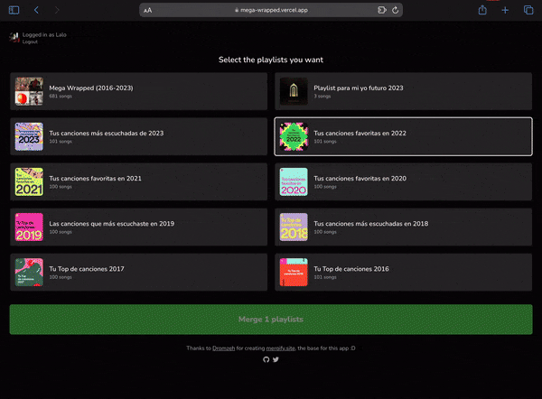

<div align="center">

# Mega Wrapped

Easily merge all your Spotify's wrapped in one playlist!



</div>

## How to use

1. Clone the repo
2. Create a `.local.env` file with the following contents:

    ```env
    SPOTIFY_CLIENT_ID = "your-spotify-client-id"
    SPOTIFY_CLIENT_SECRET = "your-spotify-client-secret"
    NEXTAUTH_SECRET = "your-nextauth-secret"
    ```

3. `npm install & npm run dev`

## Deployment in Vercel

Make sure to set the environment variables in the vercel dashboard & read <https://next-auth.js.org/warnings#nextauth_url> if you aren't
